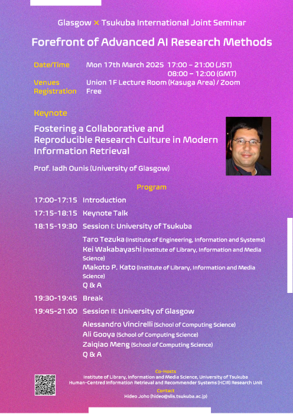

**Date/Time:** Monday 17th March 2025 08:00-12:00 (GMT), 17:00-21:00 (JST)

**Venue:** Information Media Union 1F Lecture Room, Kasuga Area (for University of Tsukuba) / Zoom (for others)

**Participants:** University of Glasgow, University of Tsukuba, HCIR Research Unit, Public

**Registration:** Please submit a [Registration Form](https://forms.office.com/r/kmFzQBtYLn) by 11th March, 2025. We will send the Zoom URL on and after 14th of March to the registered email address.

**Program:**

- 17:00-17:15 Introduction
- 17:15-18:15 Keynote Prof. Iadh Ounis (University of Glasgow)
- 18:15-19:30 Session I: University of Tsukuba
  - Prof. Taro Tezuka
  - Dr. Kei Wakabayashi
  - Dr. Makoto P. Kato
  - QA
- 19:30-19:45 Break
- 19:45-21:00 Session II: University of Glasgow
  - Prof. Alessandro Vincirelli
  - Dr. Ali Gooya
  - Dr. Zaiqiao Meng
  - QA

**Keynote:**

- **Title:** Fostering a Collaborative and Reproducible Research Culture in Modern Information Retrieval
- **Speaker:** Prof. Iadh Ounis (University of Glasgow)
- **Abstract:** In this talk, I will describe the efforts of the Information Retrieval Group at the University of Glasgow to encourage sharing and reproducible IR research over the past years, starting from earlier work on Terrier to its recent spinoff, PyTerrier. I will focus on the recent PyTerrier platform, which enables researchers and practitioners to seamlessly design and evaluate complex retrieval pipelines in a declarative way, illustrating it with examples of recent research from the group. I will also discuss the emerging challenges of ensuring reproducible and repeatable experiments in the era of neural information retrieval and propose new terminology to better capture these concepts in the current research landscape.
- **Short Bio:** Iadh Ounis is a  Professor in the School of Computing Science at the University of Glasgow, where he heads the 60-strong Information, Data and Analysis (IDA) Section, regrouping researchers in information retrieval, machine learning, data systems and computer vision. Prof. Ounis also leads the Terrier Team, a group of researchers working on the development and evaluation of novel large-scale text information retrieval techniques and applications. He is an Associate Editor at the ACM Transactions on Information Systems. Prof. Ounis has been awarded the 2022 Tony Kent Strix Award. [More information](https://www.gla.ac.uk/schools/computing/staff/iadhounis/)

**Co-Hosts:** Institute of Library, Information, and Media Science, University of Tsukuba, Human-Centred Information Retrieval and Recommender Systems (HCIR) Research Unit, University of Tsukuba

**Contact:** [Hideo Joho](https://trios.tsukuba.ac.jp/en/researcher/0000002518), Institute of Library, Information, and Media Science, University of Tsukuba.

